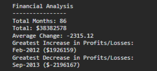

# Console Finances

## Description

Console Finances website. Given a dataset this will calculate different values based on the dataset and display them in the console.

## Table of Contents

* [Installation](#installation)
* [Usage](#usage)
* [Credits](#credits)
* [License](#license)
* [Badges](#badges)

## Installation

N/A

## Usage 

Go To: [codrincarpovici.github.io/Console-Finances/](https://codrincarpovici.github.io/Console-Finances/) and view the website. 

Once on the website, Inspect the page and check the console.
In the console you can view the console finances results. Which include:

* The total number of months included in the dataset.

* The net total amount of Profit/Losses over the entire period.

* The average of the changes in Profit/Losses.

* The greatest increase in Profit/Losses.

* The greatest decrease in Profit/Losses.

## Credits

N/A

## License
N/A

## Badges

